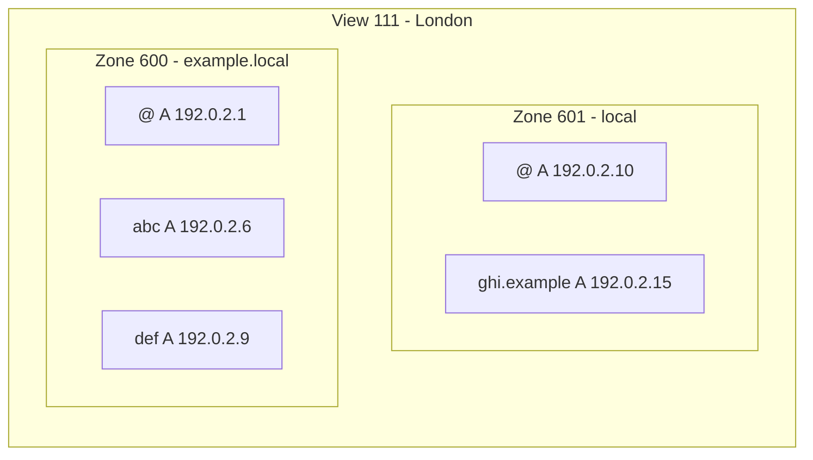

In this example, a query for `ghi.example.local` routed to view ID 111 would go to zone 600, which presents the longest matching zone name (`example.local`). Zone 600 does not contain a record for `ghi` but, if it is referencing zone 601, Cloudflare will then look for the queried record within the reference zone.
