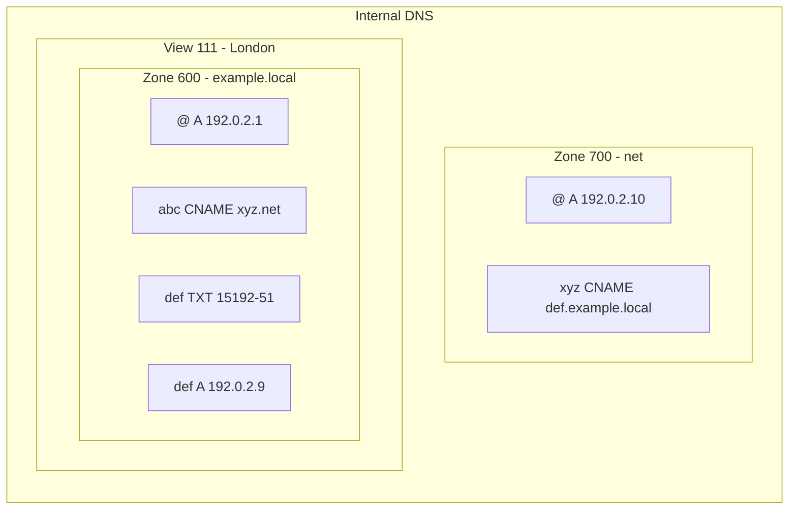

- Query for the `A` record on `abc.example.local` with view ID 111.
- Zone 600 references zone 700, which is not linked to any view.

After finding the CNAME record that points to `xyz.net`, Cloudflare cannot resolve it within zone 600. However, since this zone is referencing zone 700, this will be considered in the resolution.

The record in zone 700 points to `def.example.local`, which Cloudflare will then try to resolve in the original view. As an `A` record can be found for `def.example.local`, Cloudflare will return the corresponding IP address - in this example, `192.0.2.9`.
